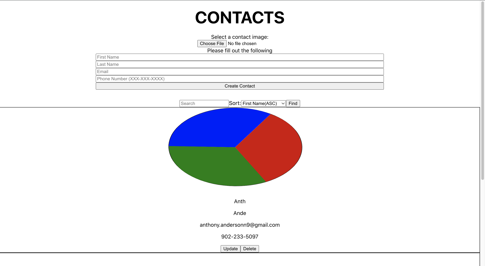
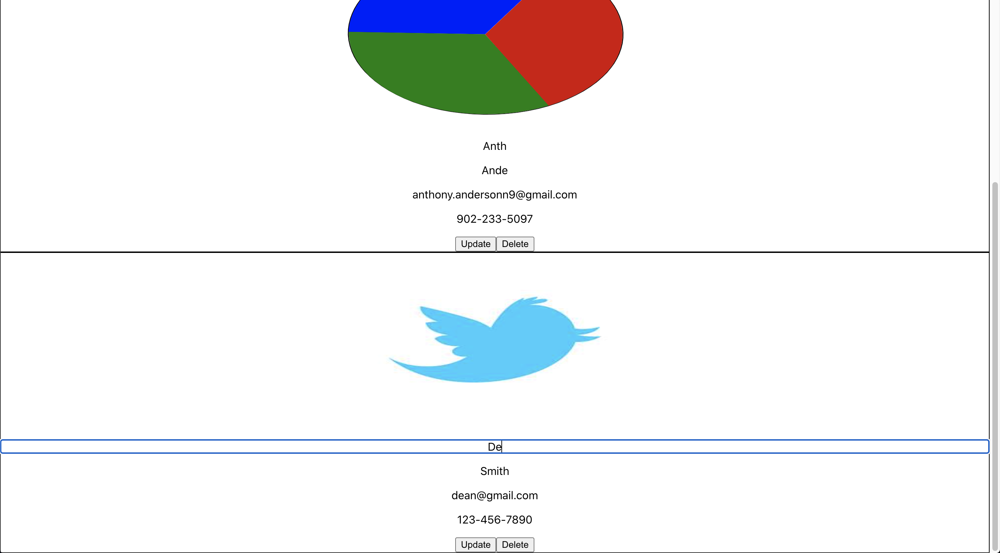

# Contact Book for Developer Test

Developed for WeUsThem as a developer test by Anthony Anderson

## How to run code
Terminal 1: In the project directory, change directory to the `backend` directory where you can run the command `node server` to run the server

Terminal 2: After starting the server in Terminal 1, in the project directory, run the command `npm start` to run the front end of the application.

## How the code works

The application communicates with the server through HTTP requests that the backend REST API uses to interact with the database. This allows for 
creating contacts, updating contacts, and deleting contacts. The UI reflects the changes of the database through the REST API that is created.

## What I used

React was used on the front-end, along with Express.js and Node.js on the backend which was used to interact with an SQLite database.

## First loaded in

## Creating Contact

## Updating Contact

